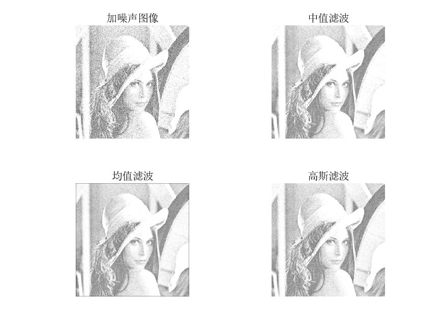
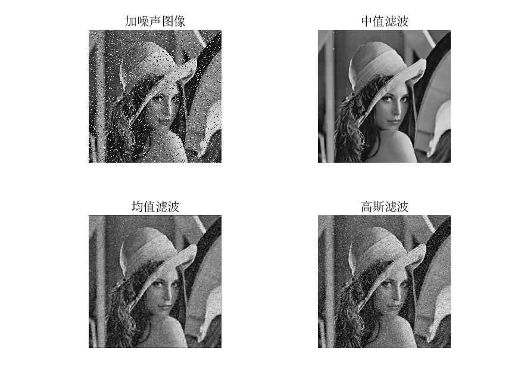
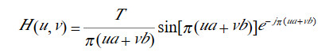
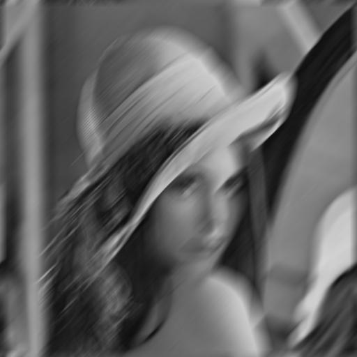
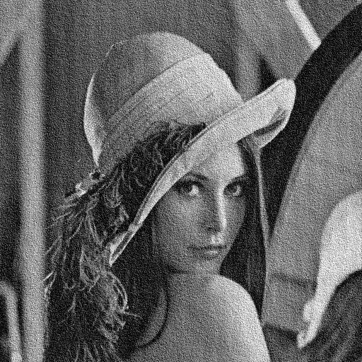

# 第六次作业

### 班级：自动化64

### 姓名：张晟

### 学号：2160504107

### 提交日期：2019/4/2

### 摘要

本次题目主要考察噪声的产生及消除。首先参考高斯噪声和椒盐噪声的生成原理，生成了指定类型的噪声，然后用使用最广泛的滤波器，中值滤波，均值滤波和高斯滤波。并对比不同滤波器在处理不同种类噪声时的i表现。最后按照题目要求实现运动模糊滤波器，并加载高斯噪声，然后利用维纳滤波和约束最小二乘滤波进行恢复。

### 第一题

#### 题目重述

在测试图像上产生高斯噪声lena图-需能指定均值和方差；并用多种滤波器恢复图像，分析各自优缺点；

#### 思路

首先在原图像上加载一个噪声，产生噪声的方法为根据噪声的PDF产生一个随机的噪声。对原图像进行退化后与噪声进行加和，得到带噪声的图像，在matlab中有imnoise函数将图像变为带噪图像。

高斯噪声的PDF与灰度值的函数关系满足正态分布函数，需要给定均值和方差。常见滤波器有中值滤波，均值滤波，高斯滤波等等，本题使用这三种方法滤波。

#### 结果

#### 分析

当高斯噪声均值不变为0时，随着方差增加，图像噪声越严重；当高斯噪声方差不变时，均值会影响到整个图像的灰度值，使整个图像变亮。与理论上均值和方差对图像的影响一致。在这几种滤波器中，均值滤波和高斯滤波效果略好于中值滤波。但是高斯滤波实现难度高于均值滤波，综合起来看均值滤波最好。

### 第二题

#### 题目重述

在测试图像lena图加入椒盐噪声（椒和盐噪声密度均是0.1）；用学过的滤波器恢复图像；在使用反谐波分析Q大于0和小于0的作用；

#### 思路

参考第一题，将噪声换成指定的椒盐噪声，在使用和第一问相同的滤波器进行处理，以方便比较。

#### 结果

#### 分析

从结果看来，属于线性滤波的均值滤波和高斯滤波在除去椒盐噪声的表现不如中值滤波，原因是椒盐噪声噪点颜色为纯黑或纯白，无论是均值还是高斯滤波都受这些点影响较大，而中值滤波能避开这些点，因此效果最好。

### 第三题

#### 题目重述

推导维纳滤波器并实现下边要求；

1. 实现模糊滤波器如方程Eq. (5.6-11).
2. 模糊lena图像：45度方向，T=1；
3. 在模糊的lena图像中增加高斯噪声，均值= 0 ，方差=10 pixels 以产生模糊图像；
4. 分别利用方程 Eq. (5.8-6)和(5.9-4)，恢复图像；并分析算法的优缺点.

#### 思路

模糊滤波器的频域表达式为：

实现该滤波器的方法为将图像进行傅里叶变换并移至图像中心，将F(u,v)与H(u,v)相乘得到G(u,v)，由G(u,v)进行傅里叶反变换得到g(x,y)

为实现题目要求，选取参数为a=,b=,T=

添加高斯噪声使用matlab中imnoise直接产生，均值为0，方差为10px

最后使用matlab中的维纳滤波和约束最小二乘滤波进行处理，多次尝试后找到较好的参数。

#### 结果

运动模糊

再加上高斯噪声

使用维纳滤波

使用约束最小二乘滤波

#### 分析

1. 通过参考所给方程得出运动模糊滤波器，结果符合预期，在45°方向上实现了模糊。
2. 关于维纳滤波和约束最小二乘滤波，调整参数非常重要，经过调试发现，参数k过大时，运动模糊的影响无法消除，k过小时，又会产生很多噪点，影响图像质量。要实现消除运动模糊的同时降噪，还需要其他滤波器的配合。